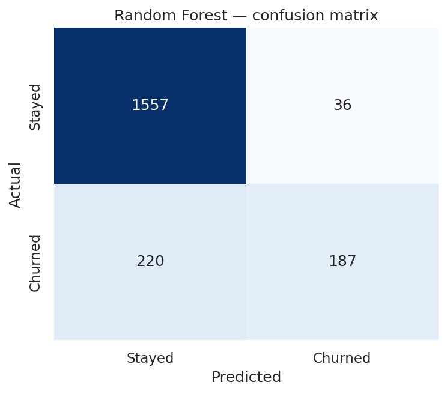
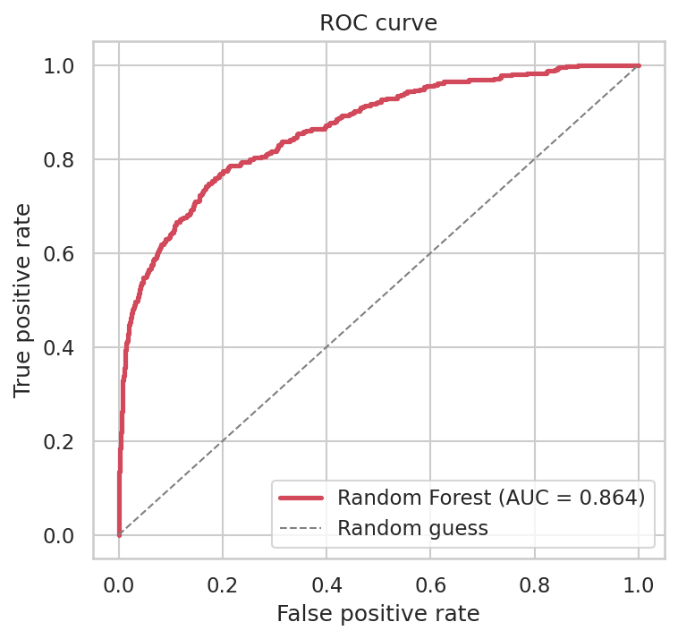
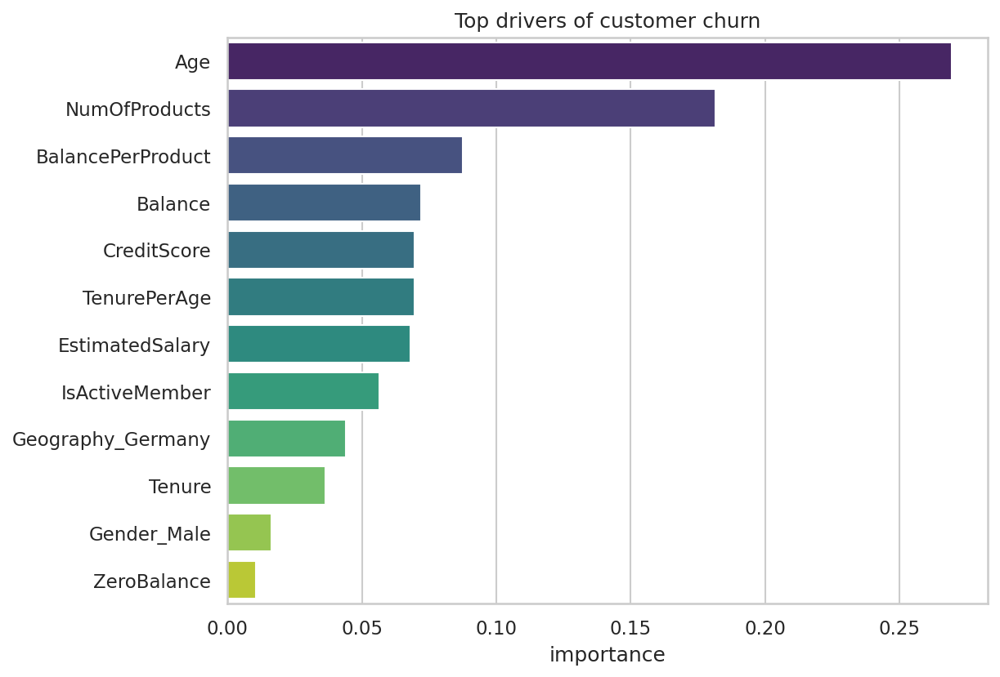
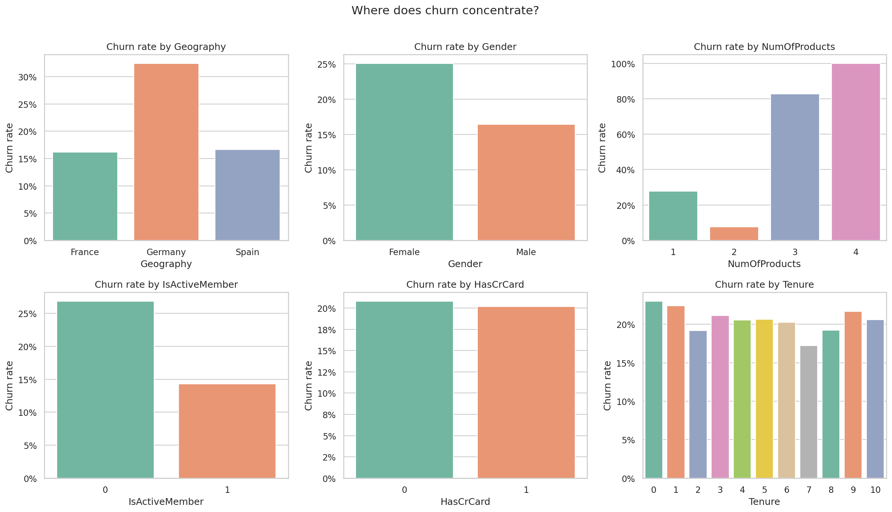
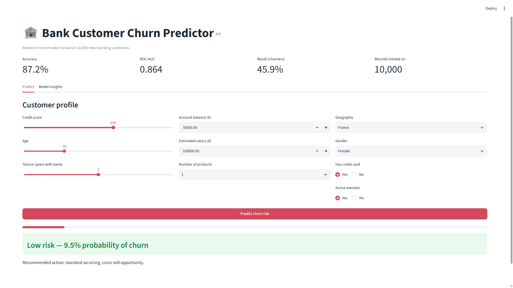
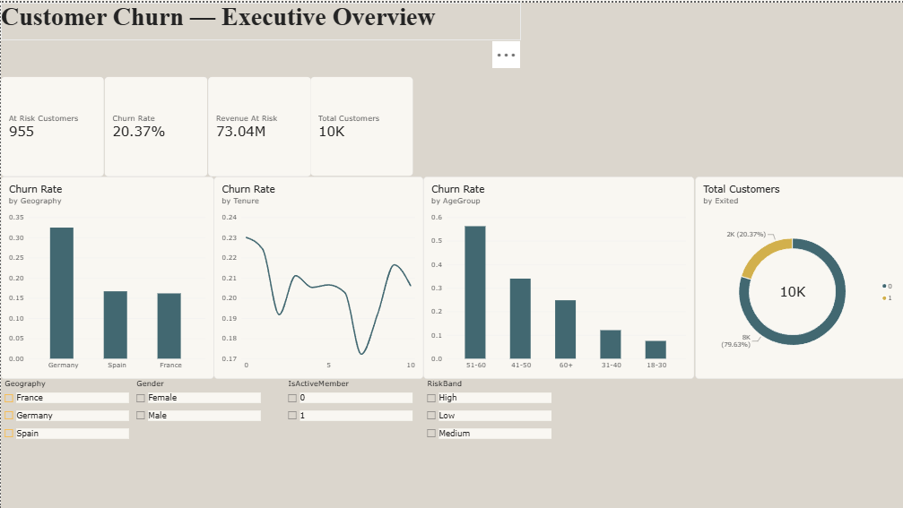
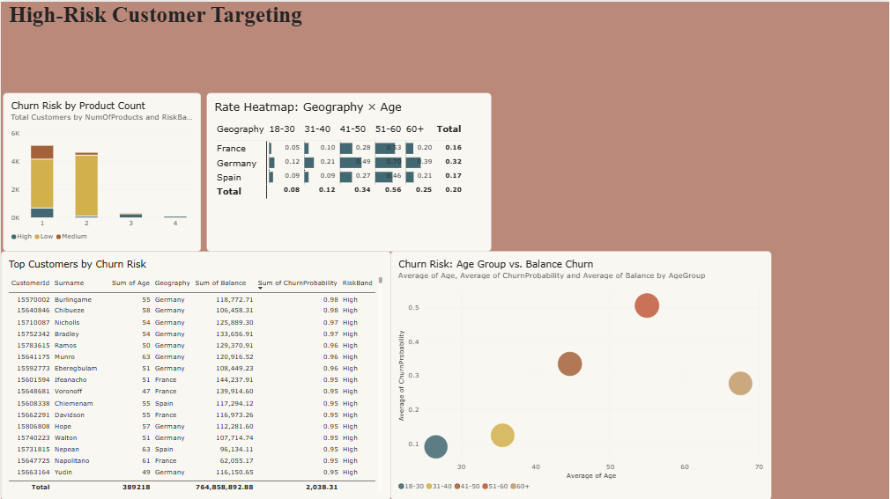

<h1 align="center">🏦 Bank Customer Churn Prediction</h1>

<p align="center">
  <b>Predicting which retail banking customers are about to leave — and why.</b><br>
  End-to-end ML project: EDA → feature engineering → model training → interactive web app → BI dashboard.
</p>

<p align="center">
  
  
  
  
  
  
  
</p>

<p align="center">
  <a href="https://bank-churn-prediction-duizieaxum4fgqxvfhuw9w.streamlit.app/"><b>🔗 Live Demo</b></a> ·
  <a href="https://colab.research.google.com/github/Atulk33029/bank-churn-prediction/blob/main/notebooks/churn_analysis_colab.ipynb"><b>📓 Open in Colab</b></a> ·
  <a href="#-results">Results</a> ·
  <a href="#-key-findings">Key Findings</a> ·
  <a href="#-quickstart">Quickstart</a>
</p>

<p align="center">
  <a href="https://colab.research.google.com/github/Atulk33029/bank-churn-prediction/blob/main/notebooks/churn_analysis_colab.ipynb">
    
  </a>
</p>

---

## 📌 Overview

Acquiring a new banking customer costs roughly 5× more than retaining an existing one, yet most churn
is only noticed after the account closes. This project analyses **10,000 retail banking customers** to
answer two questions:

1. **Who is likely to leave?** — a Random Forest classifier scores every customer with a churn probability.
2. **Why are they leaving?** — feature importance and segment analysis surface the actual drivers.

The output is a deployed web app where a relationship manager can score a customer in seconds, plus a
Power BI dashboard for portfolio-level monitoring.

---

## 📊 Results

| Model | Accuracy | Precision | Recall | F1 | ROC-AUC |
|---|---|---|---|---|---|
| Logistic Regression | 0.808 | 0.586 | 0.192 | 0.289 | 0.773 |
| Decision Tree | 0.861 | 0.776 | 0.442 | 0.563 | 0.840 |
| **Random Forest** ⭐ | **0.872** | **0.839** | **0.459** | **0.594** | **0.864** |

5-fold cross-validation accuracy: **0.866 (± 0.005)** — consistent with the hold-out result, so the
model isn't overfitting to one particular split.

<p align="center">
  
  
</p>

---

## 🔍 Key Findings



- **Age is by far the strongest predictor**, responsible for ~27% of the model's decision-making —
  more than double the next feature. Churn risk rises steadily as customers get older.
- **Number of products held is the second-biggest driver** (~18% importance) — a strong enough signal
  that it outweighs raw account balance, credit score, and salary combined.
- **The engineered `BalancePerProduct` feature (~9% importance) outranks raw `Balance` (~7%)** —
  confirming that how concentrated a customer's money is per product matters more than the total
  amount itself, which is exactly why it was worth engineering in the first place.
- **Geography (specifically being based in Germany) and account activity are mid-tier signals**
  (~4–6% importance each) — real effects, but the model leans far more heavily on age and product
  count than on where a customer banks.
- **Gender and the zero-balance flag contribute the least** (under 2% combined) — worth knowing before
  spending retention budget on gender-targeted campaigns.

<br clear="right">

<p align="center">
  
</p>

---

## 🖥️ Interactive App

<p align="center">
  
</p>

Enter a customer profile and get an instant churn probability with a Low / Medium / High risk band and a
recommended retention action. **[Try it live →](https://bank-churn-prediction-duizieaxum4fgqxvfhuw9w.streamlit.app/)**

---

## 📈 Power BI Dashboard

<p align="center">
  
  <br><br>
  
</p>

Two pages — an executive overview (churn rate KPIs, geography and age breakdowns, revenue at risk) and a
targeting page listing the highest-probability customers for outreach, with a risk heatmap by
geography × age and a bubble chart showing which age group carries both the highest balance and the
highest churn risk. Build instructions in
[`powerbi/README.md`](powerbi/README.md).

---

## 🗂️ Project Structure

```
bank-churn-prediction/
├── app.py                     # Streamlit web app
├── requirements.txt
├── data/
│   └── README.md              # Dataset source + schema (CSV is gitignored)
├── notebooks/
│   └── churn_analysis_colab.ipynb   # Full analysis, runnable in Google Colab
├── src/
│   ├── config.py              # Paths and settings
│   ├── data_prep.py           # Cleaning, feature engineering, encoding
│   ├── eda.py                 # Seaborn exploratory charts
│   └── train_model.py         # Training, evaluation, artifact export
├── models/
│   ├── churn_rf_model.joblib
│   └── metrics.json
├── reports/figures/           # All generated charts
└── powerbi/
    ├── README.md              # Dashboard build guide
    ├── churn_predictions.csv  # Scored dataset feeding the dashboard
    └── churn_dashboard.pbix
```

---

## ⚡ Quickstart

### Option 1 — Google Colab (no local setup)

Open [`notebooks/churn_analysis_colab.ipynb`](notebooks/churn_analysis_colab.ipynb) in Colab and run
it top to bottom. It performs the full analysis and downloads a zip containing the trained model,
all charts and the Power BI dataset.

### Option 2 — Run locally

```bash
# 1. Clone
git clone https://github.com/Atulk33029/bank-churn-prediction.git
cd bank-churn-prediction

# 2. Environment
python -m venv .venv
source .venv/bin/activate          # Windows: .venv\Scripts\activate
pip install -r requirements.txt

# 3. Add the dataset
#    Download Churn_Modelling.csv from Kaggle (link in data/README.md)
#    and place it in data/

# 4. Run the pipeline
python src/eda.py                  # generates exploratory charts
python src/train_model.py          # trains, evaluates, saves model + Power BI export

# 5. Launch the app
streamlit run app.py
```

---

## 🧠 Approach

**Preprocessing.** Dropped `RowNumber`, `CustomerId` and `Surname` (pure identifiers, no signal and a
leakage risk). One-hot encoded `Geography` and `Gender` with `drop_first=True`.

**Feature engineering.** Added three derived features: `BalancePerProduct`, a `ZeroBalance` flag, and
`TenurePerAge` to capture relationship maturity relative to life stage.

**Modelling.** Benchmarked Logistic Regression and a Decision Tree as baselines before settling on a
Random Forest (400 trees, `max_depth=12`, `min_samples_leaf=3`). Evaluated on a stratified 80/20 split
and confirmed with 5-fold cross-validation.

**Metric choice.** The classes are imbalanced (~20% churn), so accuracy alone is misleading — ROC-AUC
and recall on the churn class are reported alongside it. In a real deployment the decision threshold
would be tuned to the cost ratio between a wasted retention offer and a lost customer.

---

## 🚀 Possible Extensions

- SHAP values for per-customer explanations instead of global feature importance
- Threshold optimisation driven by retention-cost economics
- SMOTE or class weighting to lift recall on the minority class
- FastAPI endpoint + Docker image for production serving
- Model monitoring for data drift

---

## 📄 License

MIT — see [LICENSE](LICENSE).

---

<p align="center">
  Built by <b>Atul Kushwah</b> ·
  <a href="https://github.com/Atulk33029">GitHub</a>
</p>
